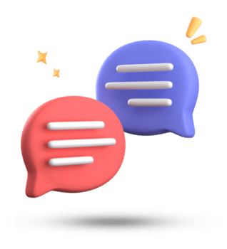
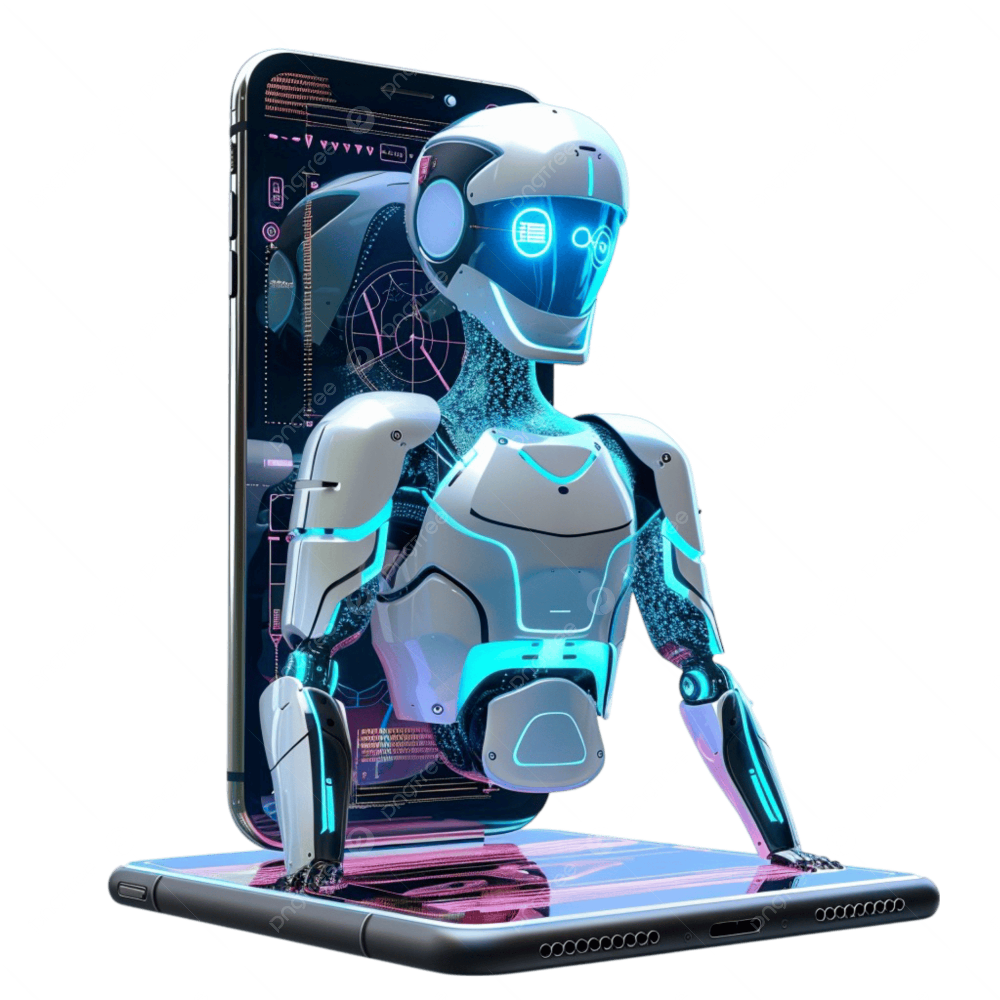
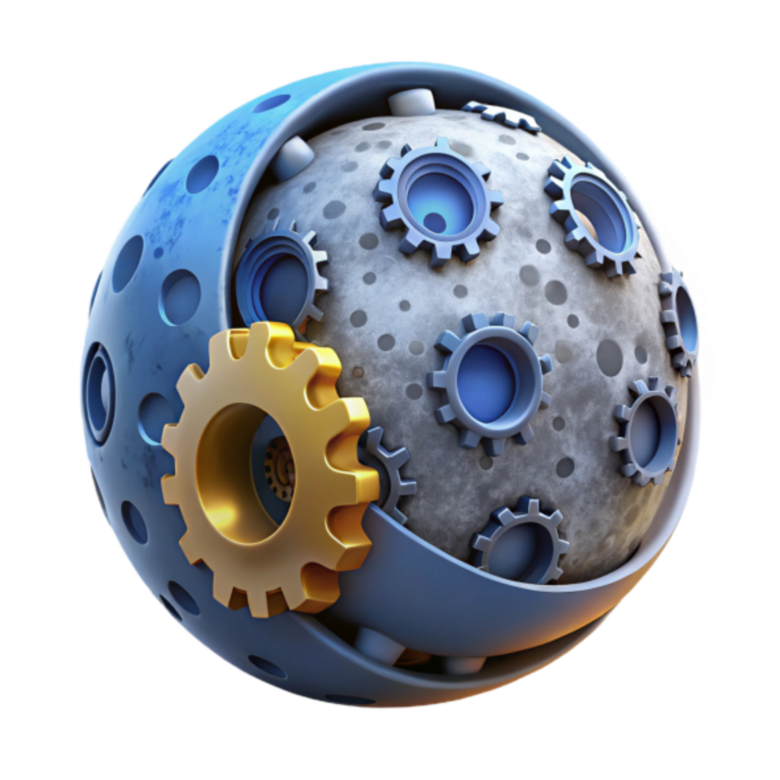

<div align="center">

# WebGPU Studio

**Local-first AI workspace — chat, vision, embeddings, and structured JSON, powered by WebGPU in your browser**

[](https://web-gpu-studio.vercel.app/)
[](https://www.w3.org/TR/webgpu/)
[](https://nextjs.org/)
[](https://react.dev/)
[](https://www.typescriptlang.org/)
[](https://sdk.vercel.ai/)

*Run open-source LLMs and vision models locally — no cloud API keys, no per-token billing.*

**Live app:** [https://web-gpu-studio.vercel.app/](https://web-gpu-studio.vercel.app/)

</div>

---

<table>
<tr>
<td width="22%" align="center" valign="top">
<br/>

<br/><br/>
<sub><b>On-device AI</b><br/>Models run in your browser<br/>via WebGPU acceleration</sub>
</td>
<td width="56%" valign="top">

## What is this?

**WebGPU Studio** is a Next.js application that brings a full AI copilot workspace to the browser. It combines **WebLLM** (WebGPU-accelerated LLM inference via MLC), **Transformers.js** (vision + server-side ONNX), and the **Vercel AI SDK** into a single polished UI — with streaming chat, image understanding, vector embeddings, and schema-validated JSON generation.

Everything runs on **open-source models** from Hugging Face. Chat and structured output execute on your **GPU** through WebGPU; vision models stream through a server route; embeddings compute entirely **client-side** and cache in IndexedDB.

**Zero API keys required** for core features (Auth0 is wired but currently disabled for public access).

</td>
<td width="22%" align="center" valign="top">
<br/>

<br/><br/>
<sub><b>Open models</b><br/>Llama, Qwen, Gemma,<br/>SmolVLM, gte-small</sub>
</td>
</tr>
</table>

---

## Studio Sections

<table>
<tr>
<td align="center" width="25%">

<br/><br/>
<b>Chat</b><br/>
<sub>Streaming text generation with domain presets<br/>Llama 3.2 · Qwen2.5 · Gemma via WebLLM</sub>
</td>
<td align="center" width="25%">

<br/><br/>
<b>Vision</b><br/>
<sub>Image upload + multimodal Q&amp;A<br/>SmolVLM2 500M / SmolVLM 256M</sub>
</td>
<td align="center" width="25%">

<br/><br/>
<b>Structured JSON</b><br/>
<sub>Typed object generation with Zod schemas<br/>Plans, specs, step-by-step output</sub>
</td>
<td align="center" width="25%">

<br/><br/>
<b>Embeddings</b><br/>
<sub>384-dim vectors, similarity search, RAG prep<br/>gte-small in-browser</sub>
</td>
</tr>
</table>

---

## Features

| Feature | Description |
|---------|-------------|
| **Streaming chat** | Token-by-token responses with stop/cancel and markdown rendering |
| **WebGPU inference** | Llama 3.2, Qwen2.5, and Gemma models run in a dedicated Web Worker via [@built-in-ai/web-llm](https://github.com/built-in-ai/web-llm) |
| **Vision chat** | Upload images and ask questions — SmolVLM models with domain presets (documents, products, medical, safety) |
| **Structured output** | `generateObject()` with Zod schemas — get typed JSON (title, summary, steps) from natural language |
| **Embeddings lab** | Compare texts, build a local library, semantic search, cosine similarity matrix — all client-side |
| **Domain presets** | Marketing, HR, customer service, and vision-specific system prompts auto-applied per model |
| **Model progress UI** | Real-time weight download progress bar during first load (WebLLM + Transformers.js) |
| **Dark / light theme** | Collapsible sidebar, responsive mobile nav, parallax welcome hero |
| **Auth-ready** | Auth0 integration present (currently disabled for open public use) |

---

## Tech Stack

### Core framework

| Layer | Technology | Role |
|-------|------------|------|
| **App** | [Next.js 15](https://nextjs.org/) App Router | Routing, API routes, SSR shell |
| **UI** | [React 19](https://react.dev/) + [TypeScript 5](https://www.typescriptlang.org/) | Components, hooks, type safety |
| **Styling** | [Tailwind CSS 3](https://tailwindcss.com/) + [Radix UI](https://www.radix-ui.com/) | Layout, sliders, selects, tooltips |
| **Animation** | [Motion](https://motion.dev/) | Welcome hero and parallax cards |
| **State** | [Zustand 5](https://zustand.docs.pmnd.rs/) | Sidebar context, theme |

### AI & inference

| Layer | Technology | Where it runs |
|-------|------------|---------------|
| **Chat / Structured** | [@built-in-ai/web-llm](https://github.com/built-in-ai/web-llm) + [MLC-LLM](https://mlc.ai/) | Browser WebGPU (Web Worker) |
| **Vision** | [@built-in-ai/transformers-js](https://github.com/built-in-ai/transformers-js) | Server CPU via `/api/chat` |
| **Embeddings** | [@huggingface/transformers](https://huggingface.co/docs/transformers.js) | Browser WebGPU / WASM |
| **Orchestration** | [Vercel AI SDK 6](https://sdk.vercel.ai/) | `streamText`, `generateObject`, streaming |
| **Validation** | [Zod 4](https://zod.dev/) | Structured JSON schemas |
| **Markdown** | [react-markdown](https://github.com/remarkjs/react-markdown) | Assistant message rendering |

### Why WebGPU?

[WebGPU](https://www.w3.org/TR/webgpu/) gives the browser direct access to the GPU compute pipeline. For LLM inference this means:

- **No server GPU cost** — chat runs on the user's machine
- **Privacy** — prompts never leave the browser for WebLLM models
- **MLC-quantized models** — 4-bit weights (q4f16) fit in consumer GPU memory
- **Persistent cache** — model weights stored in browser cache after first download

---

## Supported Models

### Chat (WebLLM / WebGPU — browser)

| Model | Size | Presets |
|-------|------|---------|
| **Llama 3.2 1B Instruct** | ~1B | General, Marketing, HR, Customer Service |
| **Llama 3.2 3B Instruct** | ~3B | General, Marketing |
| **Qwen2.5 0.5B / 1.5B / 3B** | 0.5–3B | General, Marketing, HR, Customer Service |
| **Gemma 2B IT** | ~2B | General, Marketing |

### Vision (Transformers.js — server route)

| Model | Size | Presets |
|-------|------|---------|
| **SmolVLM2 500M Instruct** | 500M | General, Documents, Product Recognition |
| **SmolVLM 256M Instruct** | 256M | General, Medical, Documents, Product, Safety |

### Embeddings (browser)

| Model | Dimensions | Use case |
|-------|------------|----------|
| **Supabase/gte-small** | 384 | Semantic search, similarity, RAG indexing |

---

## Technical Implementation

### Architecture overview

```
┌──────────────────────────────────────────────────────────────────────┐
│                         Browser (Client)                             │
├──────────────────────────────────────────────────────────────────────┤
│  Next.js Studio UI                                                   │
│    ├── / (Chat)          → useChat → WebLLM Worker → WebGPU          │
│    ├── /vision           → useChat → POST /api/chat → server CPU     │
│    ├── /structured       → useStructured → WebLLM → generateObject   │
│    └── /embeddings       → useEmbeddings → HF Transformers.js        │
│                                                                      │
│  Web Workers                                                         │
│    ├── web-llm-worker.ts       MLC WebWorkerMLCEngineHandler         │
│    └── transformers-js-worker.ts   (vision client preload)           │
├──────────────────────────────────────────────────────────────────────┤
│  Shared session layer (lib/ai/)                                      │
│    ├── webllm-session.ts    singleton worker + per-model engine cache│
│    └── transformers-session.ts   vision worker lifecycle             │
└──────────────────────────────────────────────────────────────────────┘
                              │
                              ▼
┌──────────────────────────────────────────────────────────────────────┐
│  Next.js Server (Node.js)                                            │
│    POST /api/chat          streamText + transformers-js (vision)     │
│    POST /api/model/progress  model download progress stream          │
└──────────────────────────────────────────────────────────────────────┘
```

### Inference paths

#### 1. Chat — full client-side WebGPU

```
User input → useChat.sendChat()
  → getWebLLMModel(modelId)          // cached MLC engine per model
  → prepareWebLLMSession()           // download weights with progress
  → streamText({ model, messages })  // Vercel AI SDK
  → token stream → ChatFeed UI
```

The WebLLM worker (`web-llm-worker.ts`) hosts a `WebWorkerMLCEngineHandler` so inference never blocks the main thread. A module-level worker singleton survives React Strict Mode remounts.

#### 2. Vision — server-side streaming

```
Image upload → base64 data URL → POST /api/chat
  → dynamic import @built-in-ai/transformers-js
  → dataUrlToUint8Array() for Node.js compatibility
  → streamText({ model: SmolVLM, messages: [text + image] })
  → plain text stream back to client
```

Vision uses **CPU** on the server (`device: "cpu"`) for stable ONNX inference; chat stays on **WebGPU** in the browser.

#### 3. Structured JSON — client WebGPU + Zod

```
Prompt → generateObject({ model: webLLM, schema: z.object({...}) })
  → typed JSON { title, summary, steps[] }
  → rendered in Structured section with copy-to-clipboard
```

#### 4. Embeddings — pure client-side

```
Text lines → @huggingface/transformers pipeline("feature-extraction", "Supabase/gte-small")
  → 384-dim vectors (mean pooling, normalized)
  → cosine similarity matrix / semantic search / localStorage library
```

Models cache in the browser after first download — no server bundle bloat.

### Key design decisions

| Decision | Rationale |
|----------|-----------|
| **Split inference** | WebGPU for chat (GPU-heavy), server CPU for vision (ONNX stability), browser for embeddings (zero server RAM) |
| **Dynamic imports** | `@built-in-ai/transformers-js` and `@huggingface/transformers` loaded at runtime to keep serverless functions small |
| **Worker singleton** | Prevents WebLLM init hangs from Strict Mode double-mount terminating workers mid-load |
| **Domain system prompts** | `buildDomainSystemPrompt()` in `models.ts` — auto-injects expertise context per preset |
| **Auth disabled** | Auth0 wiring preserved in comments; app runs fully public without login gates |

---

## Project Structure

```
webgpu-studio/
├── public/                          # Section preview images, logos
├── src/
│   ├── app/
│   │   ├── (studio)/                # Main studio layout + pages
│   │   │   ├── page.tsx             # Chat (home)
│   │   │   ├── vision/              # Vision chat
│   │   │   ├── structured/          # JSON generation
│   │   │   ├── embeddings/          # Embedding lab
│   │   │   └── _components/         # Sidebar, chat feed, sections
│   │   ├── api/
│   │   │   ├── chat/route.ts        # Vision streaming endpoint
│   │   │   └── model/progress/      # Download progress
│   │   ├── web-llm-worker.ts        # WebGPU LLM worker entry
│   │   └── transformers-js-worker.ts
│   ├── hooks/                       # useChat, useEmbeddings, useStructured, useModel
│   ├── lib/
│   │   ├── ai/
│   │   │   ├── models.ts            # Presets, model IDs, domain prompts
│   │   │   ├── webllm-session.ts    # Worker + engine lifecycle
│   │   │   └── transformers-session.ts
│   │   └── utils/                   # Embeddings math, storage, logger
│   └── contexts/                    # Theme, sidebar
└── next.config.ts                   # Webpack aliases, file tracing excludes
```

---

## Getting Started

**Try it live:** [https://web-gpu-studio.vercel.app/](https://web-gpu-studio.vercel.app/)

### Prerequisites

- **Node.js** 20+
- **Chrome 113+** or **Edge 113+** (WebGPU support required for chat models)
- ~2–4 GB free disk/RAM for model weight downloads (varies by model)

### Install & run

```bash
git clone https://github.com/samarthshukla6/WebGPU-Studio.git
cd WebGPU-Studio
npm install
npm run dev
```

Open **[http://localhost:3000](http://localhost:3000)**.

### Production

```bash
npm run build
npm start
```

### Environment variables (optional — Auth0)

Auth is currently disabled, but the codebase supports Auth0 v4 when re-enabled:

```env
AUTH0_SECRET='use openssl rand -hex 32'
APP_BASE_URL='http://localhost:3000'
AUTH0_DOMAIN='your-tenant.auth0.com'
AUTH0_CLIENT_ID='your-client-id'
AUTH0_CLIENT_SECRET='your-client-secret'
```

---

## Usage

1. **Chat** — Select a model from the dropdown, type a message, and watch tokens stream in. Use the welcome hero for quick starts.
2. **Vision** — Navigate to Vision, upload an image, and ask questions about it.
3. **Structured JSON** — Describe the JSON you need; get a typed object with title, summary, and steps.
4. **Embeddings** — Paste multiple lines of text, embed them, compare similarity, or build a searchable library.

> First model load downloads weights from Hugging Face / MLC — progress appears in the UI. Subsequent visits use cached weights.

---

## Related Projects

| Project | Description |
|---------|-------------|
| [**Robo Physics Simulator**](https://github.com/samarthshukla6/Robo-Physics-Simulator) | Sibling repo — browser MuJoCo WASM simulator for the SO-101 robot arm ([live demo](https://robo-simulator-peach.vercel.app/)) |
| [**WebLLM**](https://github.com/mlc-ai/web-llm) | MLC-LLM browser inference engine |
| [**Transformers.js**](https://huggingface.co/docs/transformers.js) | Hugging Face ONNX/WASM inference in JS |
| [**Vercel AI SDK**](https://sdk.vercel.ai/) | Unified streaming and structured output API |

---

## Acknowledgments

- [**Built-in AI**](https://github.com/built-in-ai) — `transformers-js` and `web-llm` packages
- [**MLC**](https://mlc.ai/) — WebGPU LLM compilation and MLC model format
- [**Hugging Face**](https://huggingface.co/) — Model hosting and Transformers.js
- [**Vercel**](https://vercel.com/) — Next.js and AI SDK
- [**Meta**](https://ai.meta.com/), [**Alibaba Qwen**](https://qwen.ai/), [**Google Gemma**](https://ai.google.dev/gemma) — Open-weight model families

---

<div align="center">

**Built for the local-first AI community**

[Live Demo](https://web-gpu-studio.vercel.app/) · [Report an Issue](https://github.com/samarthshukla6/WebGPU-Studio/issues) · [Robo Physics Simulator](https://github.com/samarthshukla6/Robo-Physics-Simulator) · [WebGPU Spec](https://www.w3.org/TR/webgpu/)

</div>
